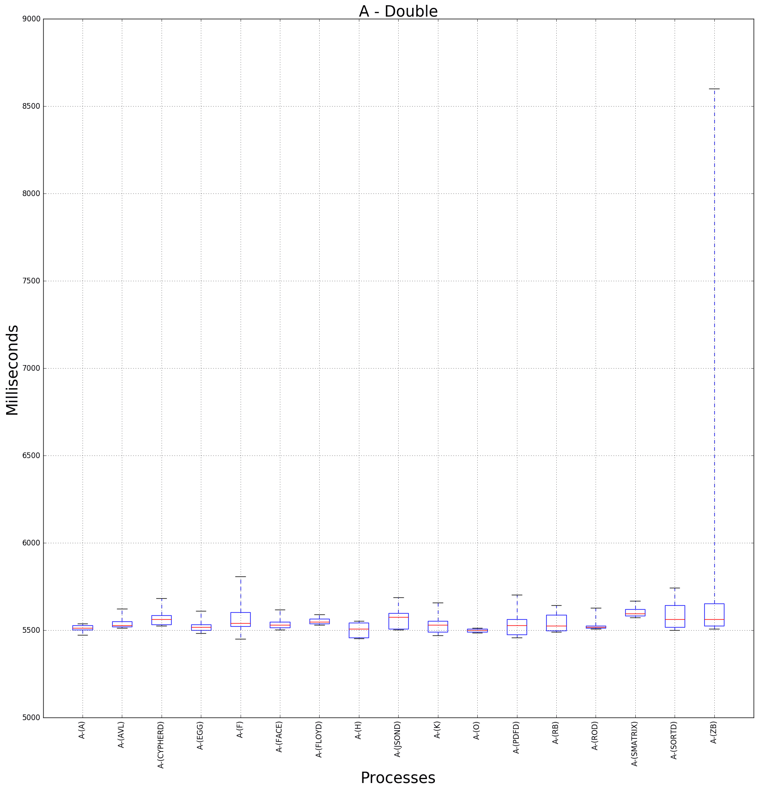
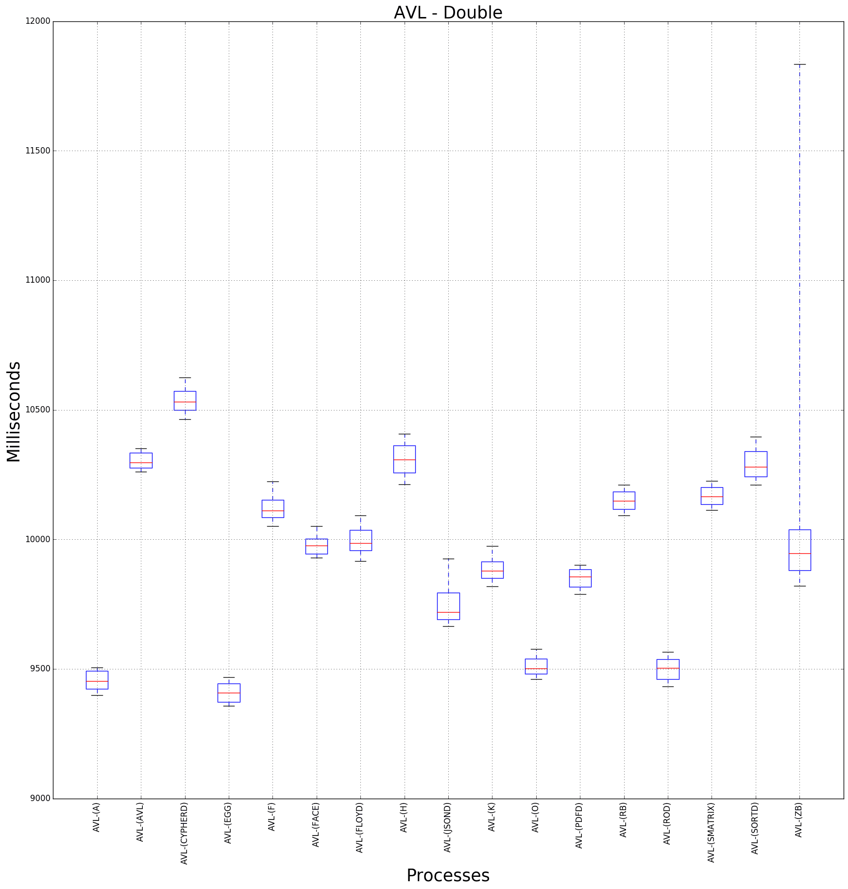
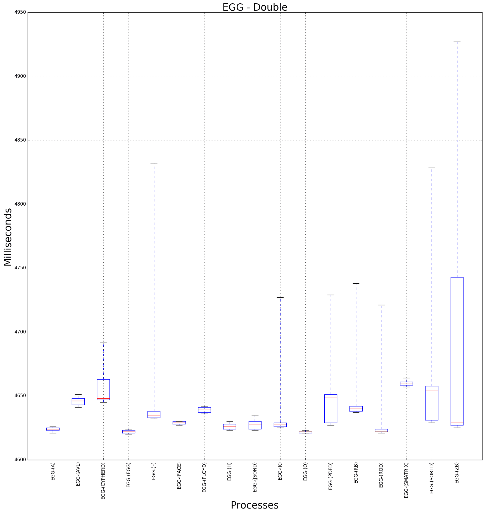
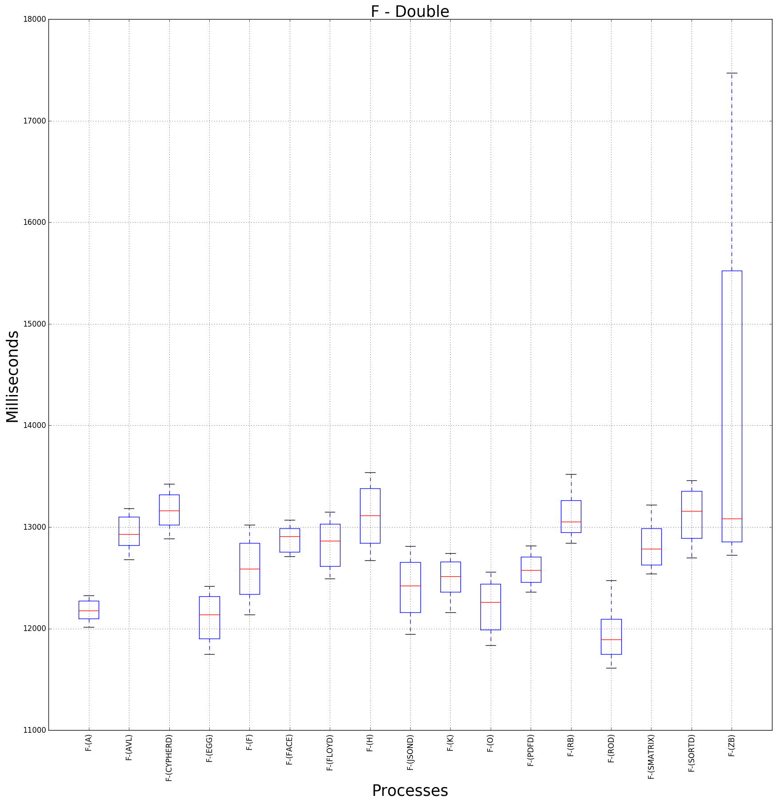
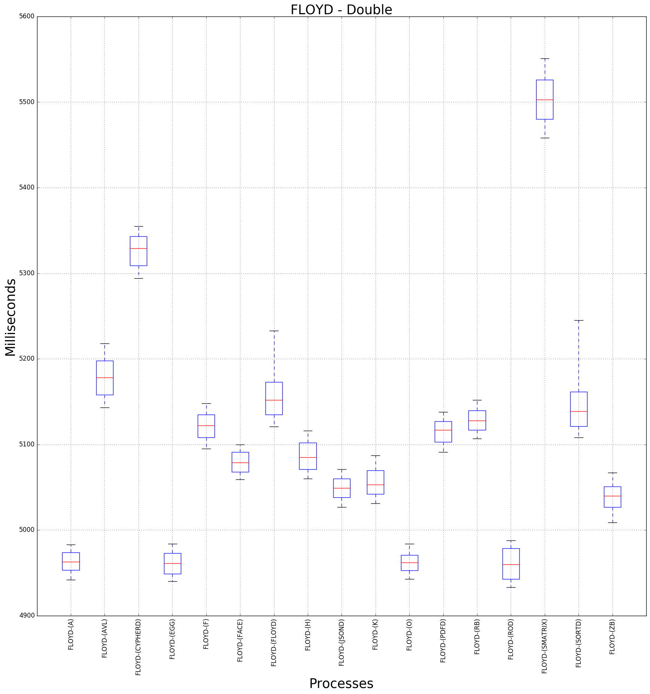
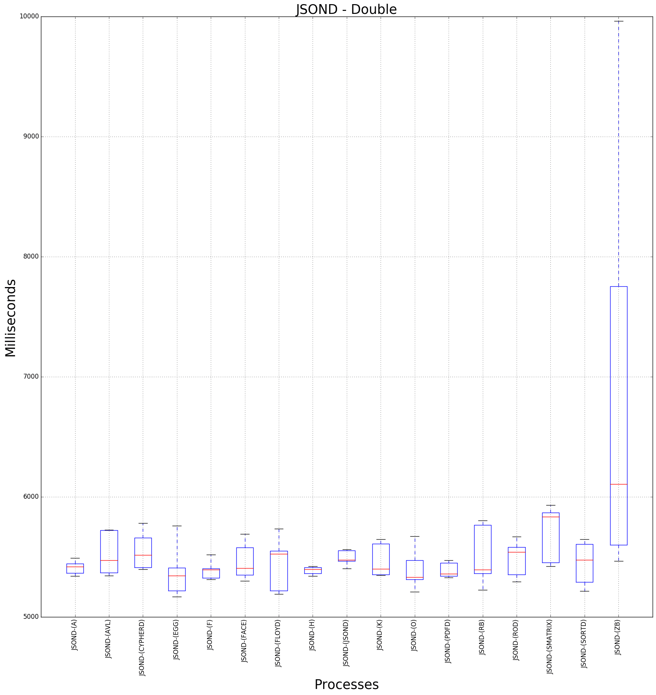
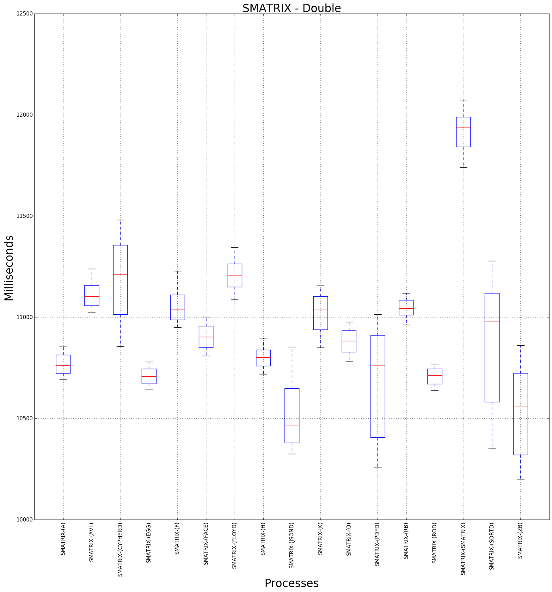

## Single and Double Benchmarks. These are the learning only benchmarks - without predictions, where state space is fully covered by tests as seen at the last picture for singles it is 17 benchmarks, for doubles it is 17x17= 289

[previous graph](../comb_quintuple_ZB/), [next graph](../whole_A/)
